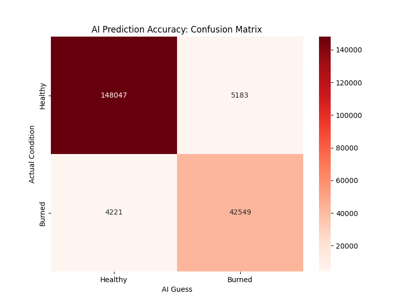
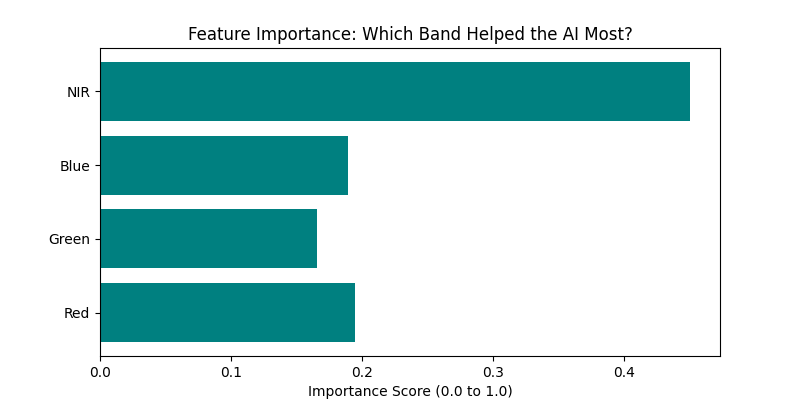
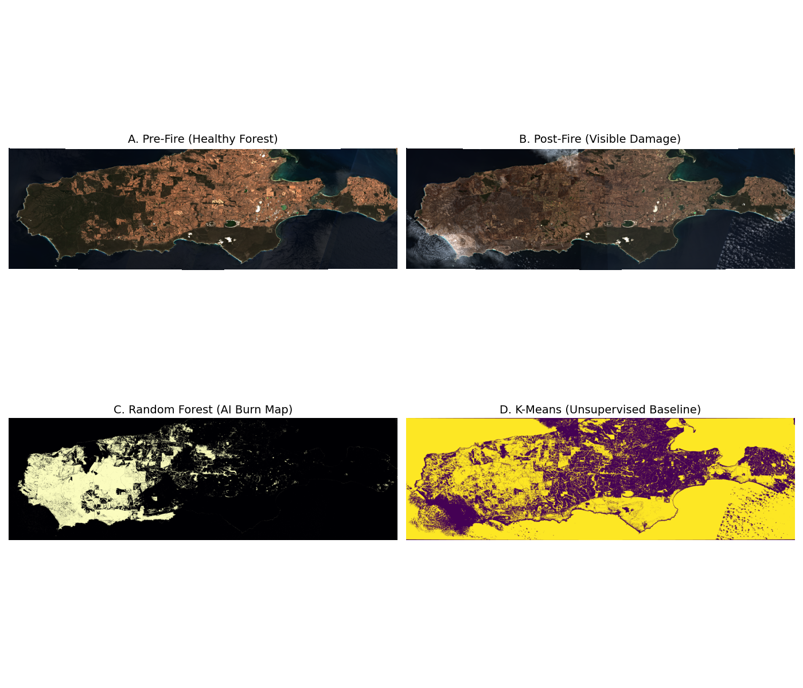

# Application of Supervised and Unsupervised Learning Algorithms for Bushfire Mapping 

### Comparative Analysis of Sentinel-2 Satellite Data to assess the 2019-2020 Bushfires in Kangaroo Island, Australia

This project explores the impact of 2019-2020 Bushfires in Kangaroo Island. Using Supervised (Random Forests) and Unsupervised Learning (K-Means Clustering) Algorithms, it maps how the severly bushfires impacted vegetation across different locations on the Island. It also evaluates the accuracy of both methods, compare results with actual post-fire imagery and calculate the environmental impact of the bushfires as well as the emissions from operating the project. 

---

## Table of Contents
1.  [Introduction](#1-introduction)
2.  [Data Collection](#2-data-collection)
3.  [Methods](#3-methods)
4.  [Notebooks](#4-notebooks)
5.  [Video](#5-video)
6.  [Results](#6-results)
7.  [Environmental Cost](#7-environmental-cost)
8.  [References and Acknowledgements](#8-references-and-acknowledgements)

---

## 1. Introduction

### Context

The 2019-2020 bushfires in Kangaroo Island were amongst the worst wildfires seen in recent history. Nearly half of the island was impacted by these fires which involved the destruction of natural habitats of animals such as koalas, wallabies and kangaroos (Bonney, 2020). 

### Problem Statement

Despite the wide availability of satellite imagery, accurately mapping land cover change post bushfires remains a challenge. A single classification method might lead to inaccurate results as burnt vegetation can be confused with dark water bodies. Therefore, a comparative analysis of different classification methods is essential to validate results. 

### Project Aim

This project aims to assess the performance of Supervised (Random Forest) and Unsupervised (K-Means Clustering) Learning algorithms in mapping and evaluating the impact of bushfires. 

---

## 2. Data Collection

### Data Source: 

1. **Location**: Kangaroo Island, South Australia.
2. **Satellite Imagery**: Sentinel-2 Satellite Imagery accessed through Google Earth Engine
3. **Acquisition Dates**: One-month median of **November-2019** and **February-2020**

#### Note that GEOTIFF files of Pre-fire and Post-fire are extracted by the code in Notebook 1 but are too big to upload on Github,hence a different image has been used below: 

### Spectral Bands Used: 

1. **Blue (B2)**, **Green (B3)**, **Red (B4)**: For True Color visualization.
2. **Near-Infrared (B8)**: Essential for vegetation health assessment (NDVI).
3. **Short-Wave Infrared (B12)**: Used for calculating burn ratios (dNBR).

---

## 3. Methods

The project followed 2 different methods (**Supervised (Random Forest)** and **Unsupervised (K-Means Clustering)**) to evaluate the impact of bushfires:

| Supervised Learning (Random Forest) | Unsupervised Learning (K-Means Clustering) |
| :--- | :--- |
|  |  |
|Supervised Learning uses manual point sampling to train a Random Forest model which is verified by a confusion matrix. |Unsupervised Learning applies K-Means Clustering to automatically segment burned areas after validating pixels.|

**Important**: Check AI4EO_figure1.pdf and AI4EO_figure2.pdf versions of both figures in the Figures folder for better image quality. 

---

## 4. Notebooks

| Notebook Name | Significance |
| :--- | :--- |
| [data_prep.ipynb](Notebooks/data_prep.ipynb) | Handles Google Earth Engine setup and the loading of Sentinel-2 images. |
| [data_analysis.ipynb](Notebooks/data_analysis.ipynb) | Compares Pre-Fire and Post-Fire Imagery: NDVI to quantify vegetation loss and burn severity. |
| [AI_training.ipynb](Notebooks/AI_training.ipynb) | Executes the Machine Learning workflows for both Random Forest (Supervised) and K-Means (Unsupervised) classification. |

---

## 5. Video Explanation 

The video below guides through jupyter notebook code mentioned above:  

---

## 6. Results

<table>
  <tr>
    <th width="10%">Figure Name</th>
    <th width="45%">Visual Output</th>
    <th width="45%">Description</th>
  </tr>
  <tr>
    <td><b>NDVI Change</b></td>
    <td></td>
    <td><b>Normalized Difference Vegetation Index:</b> Quantifies the loss of green vegetation density by comparing pre- and post-fire spectral signatures.</td>
  </tr>
  <tr>
    <td><b>Burn Severity Map</b></td>
    <td></td>
    <td><b>Burn Severity:</b> A spatial representation of fire intensity derived from the Delta Normalized Burn Ratio (dNBR) to categorize damage levels.</td>
  </tr>
  <tr>
    <td><b>Time Lapse</b></td>
    <td></td>
    <td><b>Time Lapse Video/GIF:</b> A temporal sequence visualizing the progression of the burn scar and vegetation change over the study period. (<i>Note: Use .gif for direct playback</i>).</td>
  </tr>
  <tr>
    <td><b>Random Forest Image</b></td>
    <td></td>
    <td><b>Random Forest Generated Image:</b> The final classification map produced by the supervised model, distinguishing burned areas from healthy vegetation.</td>
  </tr>
  <tr>
    <td><b>Confusion Matrix</b></td>
    <td></td>
    <td><b>Confusion Matrix:</b> A validation matrix used to assess the accuracy of the Random Forest model by comparing predicted labels against expert training samples.</td>
  </tr>
  <tr>
    <td><b>Feature Importance</b></td>
    <td></td>
    <td><b>Feature Importance:</b> A ranking of spectral bands (B4, B3, B2, B8) and indices based on their contribution to the model's predictive power.</td>
  </tr>
  <tr>
    <td><b>Final 2x2 Comparison</b></td>
    <td></td>
    <td><b>Final 2x2 Comparison:</b> A multi-panel view comparing raw satellite data, dNBR, K-Means results, and Random Forest predictions.</td>
  </tr>
</table>

### Results Summary

Key results from the figures above include: 

1. 

### Limitations
1. **Spectral Confusion**: It is often difficult to distinguish between burnt vegetation and dark water bodies as well as shadows. These similar spectral signatures can cause wrong interpretations, making it important to test different methods. 
2. **Resolution Constraints**: Sentinel-2 has a high resolution of 10m for the B4, B3,B2 and B8 spectral bands used in this study, however, that still might not be enough to detect smaller burnt patches. 
3. **Manual Sampling**: There is a manual sampling bias involved in the training dataset, although it produces highly accurate results.  

---

## 7. Environmental Cost

---
## 8. References and Acknowledgements

### Acknowledgements

I would like to thank Dr. Michel Tsamados and the course demonstraters for their constant support and guidance throughout the module. 

### References

Bonney, M.T., He, Y. and Myint, S.W., 2020. Contextualizing the 2019–2020 Kangaroo Island Bushfires: Quantifying landscape-level influences on past severity and recovery with Landsat and Google Earth Engine. Remote Sensing, 12(23), p.3942.

Copernicus Data Space Ecosystem (2026) Sentinel-2 - Copernicus Sentinel Missions. Available at: https://dataspace.copernicus.eu/data-collections/copernicus-sentinel-missions/sentinel-2 (Accessed: 14 May 2026).

Tsamados, M. and Chen, W. (2022) GEOL0069: Artificial Intelligence for Earth Observation – course notebook. University College London. Available at: https://cpomucl.github.io/GEOL0069-AI4EO/intro.html

